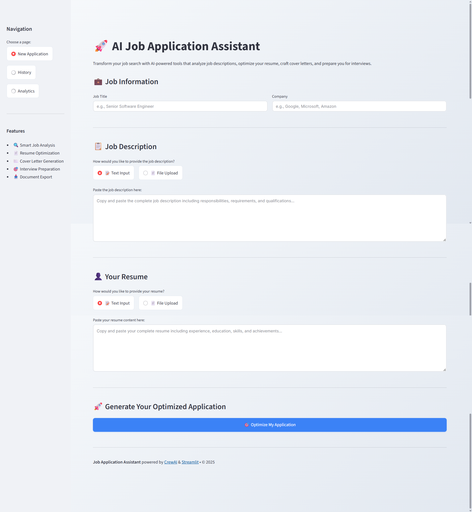

# AI Job Application Assistant

AI-driven tool that uses CrewAI to help you optimize your job applications through intelligent analysis, resume tailoring, cover letter generation, and interview preparation.


## Features

- **Job Analysis**: Extract key technical skills, responsibilities, and experience requirements from job descriptions
- **Resume Optimization**: Get tailored suggestions to optimize your resume for specific roles
- **Cover Letter Generation**: Create personalized, professional cover letters
- **Interview Preparation**: Generate relevant interview questions with suggested answers
- **Modern UI**: Clean Streamlit interface with file upload and text input options
- **Application History**: Save and review past job applications
- **Download Results**: Export all generated documents as Markdown files

## Architecture

The Job Application Assistant uses a multi-agent CrewAI system with the following components:

```
                  ┌─────────────────┐    ┌──────────────────┐    ┌─────────────────┐
                  │   Streamlit UI  │────│  Job Application │────│   Output Files  │
                  │                 │    │    Assistant     │    │   (.md files)   │
                  └─────────────────┘    └──────────────────┘    └─────────────────┘
                                                  │
                                  ┌───────────────┼───────────────┐
                                  │               │               │
                          ┌───────▼──────┐  ┌─────▼─────┐   ┌─────▼──────┐
                          │ Job Analyzer │  │Resume     │   │Cover Letter│
                          │   Agent      │  │Optimizer  │   │ Writer     │
                          └──────────────┘  │Agent      │   └────────────┘
                                            └───────────┘        
                                                  │
                                          ┌───────▼─────────┐
                                          │ Interview Coach │
                                          │     Agent       │
                                          └─────────────────┘
```

### Agent Roles:
- **Job Analyzer**: Extracts key requirements from job descriptions
- **Resume Optimizer**: Provides tailored resume improvement suggestions
- **Cover Letter Writer**: Generates personalized cover letters
- **Interview Coach**: Creates interview questions and preparation materials

## Requirements

- Python 3.8+
- Required packages (see requirements.txt)
- API keys for LLM providers (OpenAI, Google Gemini, etc.)

## Installation

1. **Clone the repository**:
   ```bash
   git clone https://github.com/hafizshakeel/ai-job-application-assistant-using-llm-crewai
   cd ai-job-application-assistant-using-llm-crewai
   ```

2. **Create a virtual environment**:
   ```bash
   python -m venv venv
   source venv/bin/activate  # On Windows: venv\Scripts\activate
   ```

3. **Install dependencies**:
   ```bash
   pip install -r requirements.txt
   ```

4. **Set up environment variables**:
   Create a `.env` file in the root directory and add your API keys:
   ```env
   # Required for LLM functionality
   GEMINI_API_KEY=your_gemini_api_key_here
   
   # Optional (for enhanced features)
   OPENAI_API_KEY=your_openai_api_key_here
   GROQ_API_KEY=your_groq_api_key_here
   ```

5. **Install diagrams package for architecture visualization**:
   ```bash
   pip install diagrams
   ```

## Usage

### Command Line Interface

1. **Basic usage with files**:
   ```bash
   python run.py --job examples/job_description.txt --resume examples/resume.txt
   ```

2. **Test with example data**:
   ```bash
   python test.py
   ```

### Streamlit Web Interface

1. **Start the application**:
   ```bash
   streamlit run streamlit_app.py
   ```

2. **Open your browser** and navigate to `http://localhost:8501`


## Project Structure

```
job-application-assistant/
├── src/
│   ├── __init__.py
│   ├── main.py           # Main application logic
│   ├── config/
│   │   ├── agents.yaml   # Agent configurations
│   │   └── tasks.yaml    # Task definitions
│   ├── tools/
│   │   ├── __init__.py
│   │   └── custom_tool.py # Web search tool
│   ├── utils/
│   │   ├── __init__.py
|   |   ├── application_processor.py  # Processing logic
│   │   ├── document_generator.py # Document saving
│   │   └── pdf_processor.py # PDF text extraction
│   └── ui/
│           ├── __init__.py
│           └── app.py       # UI components
├── examples/
│   ├── job_description.txt  # Example job description
│   └── resume.txt           # Example resume
├── assets/                  # Screenshots and images
├── requirements.txt         # Dependencies
├── streamlit_app.py         # Streamlit application
├── run.py                   # Command line runner
├── architecture_diagram.py  # Diagram generator
├── .env.example             # Example environment variables
└── README.md                # Documentation
```


## Main Interface



## ⚙️ Configuration

### Agent Configuration (agents.yaml)

Customize agent behavior by editing `src/CrewAI/config/agents.yaml`:

```yaml
job_analyzer_agent:
  role: Job Description Analyst
  goal: Analyze job descriptions and extract key requirements
  backstory: Expert in parsing job requirements and identifying key skills
```


## Testing

Run the test suite:

```bash
# Basic functionality test
python test.py

# Test with custom files
python run.py --job your_job.txt --resume your_resume.txt

# Test Streamlit app locally
streamlit run streamlit_app.py
```


## Development Notes

### Adding New Agents

1. Define agent in `src/CrewAI/config/agents.yaml`
2. Add corresponding task in `src/CrewAI/config/tasks.yaml` or mention in `src/CrewAI/main.py`
3. Update `JobApplicationAssistant` class in `src/CrewAI/main.py`

### Customizing Output Format

Modify task descriptions in the `@task` methods to change output format or add new requirements.

### Adding New Tools

Create custom tools in `src/CrewAI/tools/` and import them in the agent configurations.


## Contributing

Contributions are welcome! Please feel free to submit a Pull Request.

## License

This project is licensed under the MIT License - see the LICENSE file for details.

## Contact

Need professional support? Contact [hafizshakeel1997@gmail.com](mailto:hafizshakeel1997@gmail.com) for assistance.
